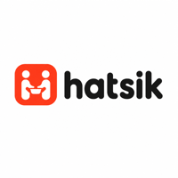
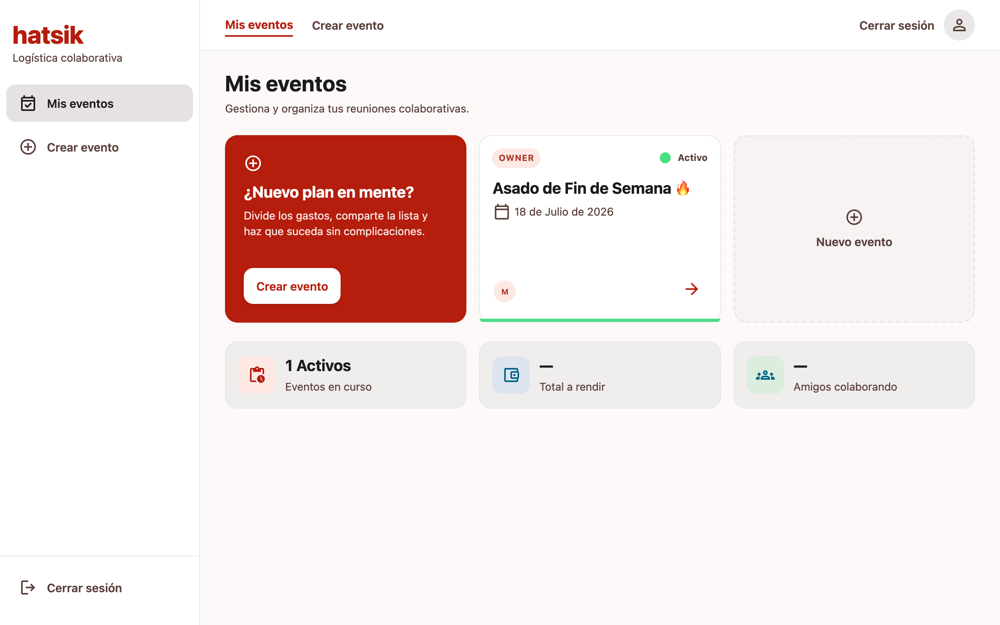
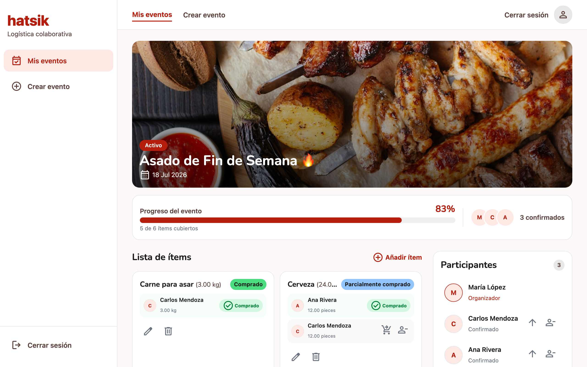
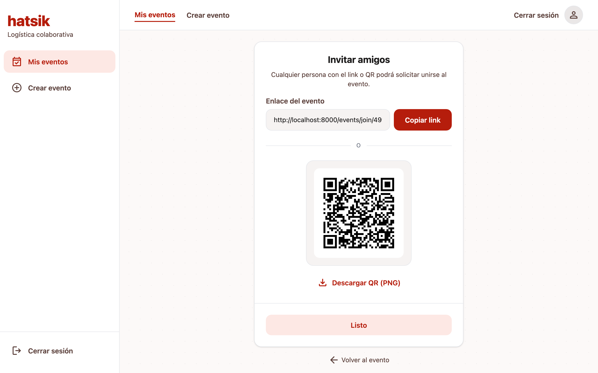
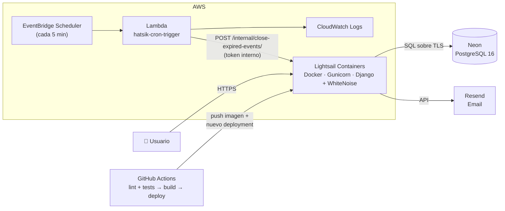

  

<h1 align="center">Hatsik</h1>

  <strong>Organiza tus convivios sin el caos del "¿qué llevo?"</strong> 
  Logística colaborativa para asados, posadas, cumpleaños y picnics.

  🔗 <a href="https://hatsik.jjjl.dev"><strong>Ver el proyecto en línea</strong></a>

---

## ¿Qué es Hatsik?

Cada vez que un grupo organiza una reunión, la coordinación de quién lleva qué termina en un hilo interminable de WhatsApp: cosas duplicadas, cosas que nadie llevó y un anfitrión estresado persiguiendo respuestas.

Hatsik resuelve ese problema con una lista colaborativa en tiempo real:

1. **El anfitrión crea el evento** y arma la lista de lo que se necesita (con cantidades y unidades opcionales).
2. **Comparte un enlace privado o un código QR** con sus invitados.
3. **Cada invitado aparta lo que va a llevar** — completo o en parte — y la lista se actualiza al instante para todos.

Nada de cuentas complicadas ni apps que instalar: es una web app pensada para que cualquiera de la familia pueda usarla.

## Capturas

| Dashboard | Detalle del evento | Compartir |
|---|---|---|
|  |  |  |

## Funcionalidades

- **Eventos privados** con acceso por invitación: los participantes solicitan entrada y el anfitrión (o un co-admin) los aprueba.
- **Lista de artículos con estado en vivo**: cada artículo muestra cuánto falta y quién lo lleva, evitando compras duplicadas o huecos.
- **Aportaciones parciales**: si se necesitan 10 kg de carne, dos personas pueden apartar 5 kg cada una.
- **Roles por evento**: Owner, Co-admin y Participante — la misma persona puede ser anfitrión en un evento e invitado en otro.
- **Compartir por enlace o QR**, pensado para moverse por WhatsApp.
- **Cierre automático de eventos** vencidos, sin intervención manual.

## Stack técnico

| Capa | Tecnología |
|---|---|
| Backend | Django 5.2 (monolito orientado a templates, sin SPA) |
| Interactividad | HTMX 2.x |
| Estilos | Tailwind CSS 4.x (CLI standalone, compilado en build) |
| Base de datos | PostgreSQL 16 en [Neon](https://neon.tech) (serverless) |
| Email transaccional | [Resend](https://resend.com) (verificación de cuenta, reset de contraseña) |
| Servidor | Gunicorn + WhiteNoise (estáticos servidos por la propia app) |
| Empaquetado | Docker (`python:3.12-slim`) |
| Hosting | AWS Lightsail Containers |
| CI/CD | GitHub Actions |

La decisión de fondo: un monolito Django con HTMX en lugar de SPA + API. Menos piezas móviles, deploy de un solo contenedor y toda la lógica en un mismo lugar — suficiente y sobrado para el dominio del producto.

## Arquitectura en AWS

Cómo fluye una petición y qué hace cada pieza:

- **Lightsail Containers** hospeda el contenedor Docker y termina TLS. Dentro corre Gunicorn con Django; los archivos estáticos los sirve WhiteNoise desde el mismo proceso — no hay nginx ni CDN, una pieza menos que operar.
- **Neon** provee PostgreSQL 16 serverless, conectado por TLS. Al ser gestionado y con free tier generoso, se eligió sobre RDS para mantener el costo del proyecto mínimo.
- **Resend** envía los correos transaccionales vía API.
- **EventBridge Scheduler + Lambda** ejecutan un cron cada 5 minutos: la Lambda llama a un endpoint interno de Django (protegido con token) que cierra los eventos vencidos. Los logs quedan en CloudWatch.
- **GitHub Actions** es el pipeline completo: en cada push a `main` corre lint (ruff) y tests (pytest contra PostgreSQL real), construye la imagen `linux/amd64`, la sube a Lightsail y crea el nuevo deployment con las variables de entorno inyectadas desde GitHub Secrets. Lightsail hace health checks antes de enrutar tráfico a la versión nueva.

## El nombre

**Hatsik** viene del maya: *dividir, compartir*. La marca se apoya en tres palabras — calidez, claridad y alegría — y la idea de que la app se comporte como un buen anfitrión: todo está organizado, tú solo llegas y aportas.
