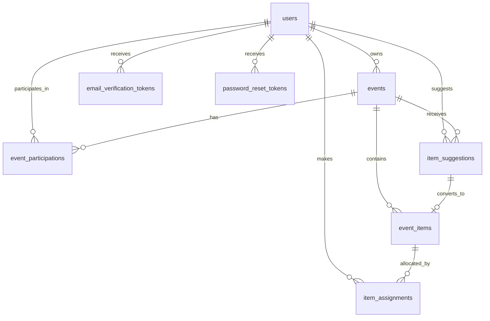

# DATABASE_SCHEMA.md — Hatsik

## Propósito

Definir el modelo relacional de Hatsik con foco en:

- Tenanting SaaS directamente por `user_id`.
- Eventos propiedad de un usuario (`owner_user_id`).
- Historial de acceso y participación sin borrar la relación usuario-evento.
- Lista de ítems, asignaciones y sugerencias con reglas de cantidad/unidad explícitas.
- Tokens transaccionales de cuenta para verificación y recuperación.

## Decisiones clave

| Tema | Decisión |
|---|---|
| Tenanting SaaS | La partición lógica del sistema es por `user_id`. No existe `organization` ni `workspace`. |
| Propiedad del evento | Cada evento pertenece a un único usuario mediante `events.owner_user_id`. |
| Relación usuario-evento | `event_participations` conserva historial de estado; no se elimina la fila para “salirse” o “ser removido”. |
| Estados de acceso | `pending`, `accepted`, `rejected`, `left`, `removed`. |
| Link público del evento | Se modela con un token opaco largo y único en `events.public_share_token`; no hay `slug`. |
| QR | Se genera on-demand a partir del token y no se almacena en la base. |
| Billing | Suscripciones, pagos y facturación están fuera del MVP; solo se documenta el tenanting por usuario. |
| Estado del ítem | No se persiste. Se deriva desde asignaciones y marcas de compra parciales/completas. |
| Soft delete | Se evita borrar entidades de negocio; se prefieren estados terminales y marcas temporales. |

## ERD

## Diccionario de datos

### `users`

| Campo | Tipo | Restricciones | Notas |
|---|---|---|---|
| `id` | `uuid` | PK | Identificador primario. |
| `display_name` | `varchar` | NOT NULL | Nombre visible del usuario. |
| `email` | `varchar` | NOT NULL, UNIQUE | Debe almacenarse normalizado a minúsculas. |
| `password_hash` | `text` | NOT NULL | Hash seguro de la contraseña. |
| `email_verified_at` | `timestamptz` | NULL | `NULL` mientras la cuenta siga sin verificar. |
| `created_at` | `timestamptz` | NOT NULL | Alta del registro. |
| `updated_at` | `timestamptz` | NOT NULL | Última modificación. |

### `email_verification_tokens`

| Campo | Tipo | Restricciones | Notas |
|---|---|---|---|
| `id` | `uuid` | PK | Identificador primario. |
| `user_id` | `uuid` | NOT NULL, FK → `users.id` | Cuenta a verificar. |
| `token_hash` | `text` | NOT NULL, UNIQUE | Se guarda el hash, no el token plano. |
| `expires_at` | `timestamptz` | NOT NULL | Vence a las 24 horas. |
| `consumed_at` | `timestamptz` | NULL | Marca de uso del token. |
| `created_at` | `timestamptz` | NOT NULL | Momento de emisión. |

### `password_reset_tokens`

| Campo | Tipo | Restricciones | Notas |
|---|---|---|---|
| `id` | `uuid` | PK | Identificador primario. |
| `user_id` | `uuid` | NOT NULL, FK → `users.id` | Cuenta que solicita el reseteo. |
| `token_hash` | `text` | NOT NULL, UNIQUE | Se guarda el hash, no el token plano. |
| `expires_at` | `timestamptz` | NOT NULL | Vence a la 1 hora. |
| `consumed_at` | `timestamptz` | NULL | Marca de uso del token. |
| `created_at` | `timestamptz` | NOT NULL | Momento de emisión. |

### `events`

| Campo | Tipo | Restricciones | Notas |
|---|---|---|---|
| `id` | `uuid` | PK | Identificador primario. |
| `owner_user_id` | `uuid` | NOT NULL, FK → `users.id` | Usuario dueño del evento. |
| `name` | `varchar` | NOT NULL | Nombre del evento. |
| `description` | `text` | NULL | Contexto opcional del evento. |
| `event_date` | `date` | NOT NULL | Fecha del convivio. |
| `assignment_deadline_at` | `timestamptz` | NULL | Fecha/hora límite para nuevas asignaciones. |
| `public_share_token` | `uuid` | NOT NULL, UNIQUE | Token opaco para link compartible. No es slug. |
| `status` | `event_status` | NOT NULL | Estado actual del evento. |
| `closed_at` | `timestamptz` | NULL | Momento de cierre. |
| `cancelled_at` | `timestamptz` | NULL | Momento de cancelación. |
| `created_at` | `timestamptz` | NOT NULL | Alta del registro. |
| `updated_at` | `timestamptz` | NOT NULL | Última modificación. |

### `event_participations`

| Campo | Tipo | Restricciones | Notas |
|---|---|---|---|
| `id` | `uuid` | PK | Identificador primario. |
| `event_id` | `uuid` | NOT NULL, FK → `events.id` | Evento al que pertenece la participación. |
| `user_id` | `uuid` | NOT NULL, FK → `users.id` | Usuario involucrado. |
| `role` | `event_role` | NOT NULL | Rol dentro del evento. |
| `access_status` | `access_status` | NOT NULL | Estado del acceso y del historial. |
| `requested_at` | `timestamptz` | NULL | Cuándo se solicitó ingreso. |
| `responded_at` | `timestamptz` | NULL | Cuándo se aceptó o rechazó. |
| `left_at` | `timestamptz` | NULL | Cuándo salió voluntariamente. |
| `removed_at` | `timestamptz` | NULL | Cuándo fue removido. |
| `created_at` | `timestamptz` | NOT NULL | Alta del registro. |
| `updated_at` | `timestamptz` | NOT NULL | Última modificación. |

### `event_items`

| Campo | Tipo | Restricciones | Notas |
|---|---|---|---|
| `id` | `uuid` | PK | Identificador primario. |
| `event_id` | `uuid` | NOT NULL, FK → `events.id` | Evento dueño de la lista. |
| `source_suggestion_id` | `uuid` | NULL, FK → `item_suggestions.id`, UNIQUE | Traza opcional cuando el ítem nació de una sugerencia aprobada. |
| `name` | `varchar` | NOT NULL | Nombre del ítem. |
| `quantity_total` | `numeric(12,2)` | NULL | Cantidad total del ítem. Si es `NULL`, el ítem es binario y `unit` debe ser `NULL`. |
| `unit` | `item_unit` | NULL | Unidad del catálogo. Requerida solo si `quantity_total` tiene valor. |
| `created_by_user_id` | `uuid` | NOT NULL, FK → `users.id` | Usuario que creó el ítem. |
| `created_at` | `timestamptz` | NOT NULL | Alta del registro. |
| `updated_at` | `timestamptz` | NOT NULL | Última modificación. |

### `item_assignments`

| Campo | Tipo | Restricciones | Notas |
|---|---|---|---|
| `id` | `uuid` | PK | Identificador primario. |
| `item_id` | `uuid` | NOT NULL, FK → `event_items.id` | Ítem asignado. |
| `user_id` | `uuid` | NOT NULL, FK → `users.id` | Usuario asignado. |
| `quantity_assigned` | `numeric(12,2)` | NULL | Requerida solo para ítems cuantificados. Debe ser `NULL` en ítems binarios y mayor que `0` cuando aplica. |
| `purchased_at` | `timestamptz` | NULL | Marca de compra. |
| `purchased_by_user_id` | `uuid` | NULL, FK → `users.id` | Quién marcó como comprado. |
| `cancelled_at` | `timestamptz` | NULL | Marca de cancelación. |
| `cancelled_by_user_id` | `uuid` | NULL, FK → `users.id` | Quién canceló la asignación. |
| `created_at` | `timestamptz` | NOT NULL | Alta del registro. |
| `updated_at` | `timestamptz` | NOT NULL | Última modificación. |

### `item_suggestions`

| Campo | Tipo | Restricciones | Notas |
|---|---|---|---|
| `id` | `uuid` | PK | Identificador primario. |
| `event_id` | `uuid` | NOT NULL, FK → `events.id` | Evento donde se sugiere el ítem. |
| `suggested_by_user_id` | `uuid` | NOT NULL, FK → `users.id` | Autor de la sugerencia. |
| `name` | `varchar` | NOT NULL | Nombre propuesto. |
| `quantity_total` | `numeric(12,2)` | NULL | Cantidad sugerida. Si es `NULL`, la sugerencia es binaria y `unit` debe ser `NULL`. |
| `unit` | `item_unit` | NULL | Requerida solo si `quantity_total` tiene valor. |
| `status` | `suggestion_status` | NOT NULL | Estado de revisión. |
| `reviewed_by_user_id` | `uuid` | NULL, FK → `users.id` | Owner o co-admin que revisó. |
| `reviewed_at` | `timestamptz` | NULL | Momento de revisión. |
| `rejection_note` | `text` | NULL | Nota visible si se rechaza. |
| `converted_event_item_id` | `uuid` | NULL, FK → `event_items.id`, UNIQUE | Ítem creado al aprobar la sugerencia. |
| `created_at` | `timestamptz` | NOT NULL | Alta del registro. |
| `updated_at` | `timestamptz` | NOT NULL | Última modificación. |

## Enums y catálogos

### `event_status`

| Valor | Uso |
|---|---|
| `active` | Evento abierto para gestión normal. |
| `closed` | No acepta nuevas solicitudes ni nuevas asignaciones. |
| `cancelled` | Evento cancelado y terminal. |

### `event_role`

| Valor | Uso |
|---|---|
| `owner` | Creador del evento. |
| `co_admin` | Usuario con permisos delegados. |
| `participant` | Usuario participante regular. |

### `access_status`

| Valor | Uso |
|---|---|
| `pending` | Solicitud pendiente. |
| `accepted` | Acceso aceptado. |
| `rejected` | Solicitud rechazada. |
| `left` | El usuario salió voluntariamente. |
| `removed` | El usuario fue removido. |

### `suggestion_status`

| Valor | Uso |
|---|---|
| `pending_approval` | Sugerencia pendiente de revisión. |
| `approved` | Sugerencia aprobada y convertida en ítem. |
| `rejected` | Sugerencia rechazada. |

### `item_unit`

| Valor | Uso |
|---|---|
| `kg` | Kilogramos. |
| `g` | Gramos. |
| `liters` | Litros. |
| `ml` | Mililitros. |
| `pieces` | Piezas. |
| `packages` | Paquetes. |
| `bags` | Bolsas. |
| `boxes` | Cajas. |
| `cans` | Latas. |
| `bottles` | Botellas. |
| `jugs` | Garrafones. |
| `trays` | Charolas. |
| `dozens` | Docenas. |

## Reglas derivadas

| Regla | Descripción |
|---|---|
| Estado del ítem | No se almacena en `event_items`. Se deriva desde cantidad total, asignaciones activas y marcas de compra. |
| Ítem binario | Si `quantity_total` es `NULL`, el ítem es binario. `unit` también debe ser `NULL`. |
| Ítem cuantificado | Si `quantity_total` tiene valor, `unit` es obligatoria y `quantity_assigned` también. |
| Cota de asignaciones | La suma de `quantity_assigned` de asignaciones activas (`cancelled_at IS NULL`) no puede superar `quantity_total`. Un usuario puede re-asignarse al mismo ítem después de cancelar (se crea nueva fila; el partial unique lo permite). |
| Compra de asignación | Una asignación comprada queda inmutable en el MVP. |
| Historia de participación | No se borra la fila de `event_participations`; se actualiza `access_status` y sus timestamps terminales. Una sola fila por par (event, user) — el reingreso muta la fila existente de `left`/`removed` a `pending`, reseteando `requested_at` al momento actual. Los timestamps anteriores (`left_at`, `removed_at`, `responded_at`) se preservan como último estado conocido. Historial multi-entrada queda fuera del MVP. |
| Reingreso tras salir | Un usuario que salió o fue removido puede volver a solicitar acceso. La aplicación actualiza `access_status = pending` y `requested_at = NOW()` en la fila existente. No se crea nueva fila. |
| Rechazo de solicitud | Una solicitud rechazada no habilita reintento automático por el mismo usuario, salvo corrección manual de Owner/co-admin. |
| Owner del evento | Al crear un evento, se debe crear también la participación inicial del Owner con `role = owner` y `access_status = accepted`. |
| QR | Se genera desde `public_share_token` en la capa de aplicación; no se persiste como archivo o blob. |
| Progress de lista | Cualquier progreso global del evento también es derivado, no persistido. |

## Índices y restricciones únicas

| Índice / restricción | Tabla | Tipo | Motivo |
|---|---|---|---|
| `users_email_key` | `users(email)` | UNIQUE | Login y deduplicación de cuentas. |
| `email_verification_tokens_token_hash_key` | `email_verification_tokens(token_hash)` | UNIQUE | Unicidad del token emitido. |
| `password_reset_tokens_token_hash_key` | `password_reset_tokens(token_hash)` | UNIQUE | Unicidad del token emitido. |
| `events_public_share_token_key` | `events(public_share_token)` | UNIQUE | Link compartible opaco y estable. |
| `event_participations_event_user_key` | `event_participations(event_id, user_id)` | UNIQUE | Una sola fila por par usuario-evento. La fila es **mutable**: el reingreso actualiza `access_status` de `left`/`removed` a `pending` in-place (no se crea nueva fila). El historial detallado de entradas/salidas queda fuera del MVP. |
| `event_participations_event_status_idx` | `event_participations(event_id, access_status)` | INDEX | Bandeja de solicitudes y filtros por estado. |
| `event_participations_user_idx` | `event_participations(user_id)` | INDEX | Dashboard del usuario. |
| `event_items_event_idx` | `event_items(event_id)` | INDEX | Listado de ítems por evento. |
| `item_assignments_item_user_key` | `item_assignments(item_id, user_id)` | UNIQUE (partial: `WHERE cancelled_at IS NULL`) | Un usuario no repite asignación **activa** para el mismo ítem. Permite re-asignarse después de cancelar. |
| `item_assignments_item_idx` | `item_assignments(item_id)` | INDEX | Cálculos de cobertura y compra. |
| `item_assignments_user_idx` | `item_assignments(user_id)` | INDEX | Vista de asignaciones del usuario. |
| `item_suggestions_event_status_idx` | `item_suggestions(event_id, status)` | INDEX | Cola de moderación. |
| `item_suggestions_suggested_by_idx` | `item_suggestions(suggested_by_user_id)` | INDEX | Historial de sugerencias por usuario. |

## Alcance fuera del MVP

| Tema | Estado |
|---|---|
| `organization` / `workspace` | Fuera. El tenanting es por usuario. |
| `subscriptions`, `payments`, `billing` | Fuera. No se modelan tablas ni relaciones. |
| `notifications` | Fuera. No se agrega centro, historial ni delivery de notificaciones. |
| `analytics` | Fuera. No se persisten métricas de producto en este esquema. |
| `invitations` | Fuera. El acceso es por link/QR con token del evento. |
| `event_slugs` legibles | Fuera. Se usa token opaco. |
| `qr_codes` persistidos | Fuera. Se generan bajo demanda. |
| `oauth_accounts` | Fuera del MVP. |
| `public_event_directory` | Fuera del MVP. |
| `multiple_lists_per_event` | Fuera del MVP. |

## Notas de implementación

- Los identificadores deben ser `uuid` en todas las tablas.
- Todas las tablas deben incluir `created_at` y `updated_at`.
- Las columnas monetarias no existen en este MVP.
- Las reglas de cantidad y cobertura deben validarse en la aplicación y, si se desea, reforzarse con constraints o triggers.
- Cualquier cambio de estado que cierre o termine una relación debe preservar historial por timestamp, no por borrado físico.
